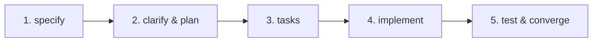

# 🚀 Guide de Méthodologie, Architecture & Tests pour QuickToken-UI

Ce document constitue la référence absolue pour le développement, l'assurance qualité et la maintenance du projet QuickToken-UI. Il s'applique à tous les développeurs et agents IA intervenant sur le codebase.

---

## 🏛️ 1. Architecture Globale & Standards de Code

### A. Organisation Modulaire par Domaine
Le code est structuré par entités métier pour garantir l'isolation et la scalabilité :
- `/src/components/ui/` : Primitives d'interface pures, accessibles et agnostiques du métier (Boutons, Modales, Inputs).
- `/src/components/<feature>/` : Vues et composants propres à un domaine métier.
- `/src/store/` : Gestionnaire d'état découpé en **slices indépendants** par domaine (évite le "God Store").
- `/src/lib/` : Fonctions pures, schémas de validation Zod, utilitaires monétaires et connecteurs d'API/Bases.
- `/src/types/` : Contrats d'interfaces et types TypeScript partagés.

### B. Règle TypeScript Absolue
- **Zéro `any`** : Tout type doit être explicitement défini ou inféré via Zod (`z.infer<typeof Schema>`).
- Validation à l'exécution systématique à chaque frontière d'entrée/sortie de données.

---

## 📋 2. Workflow Spec-Driven Development (SDD)

Toute fonctionnalité majeure ou refactor architectural doit respecter le cycle SDD :



1. **`specify` (Spécification) :** Rédiger le cahier des charges technique et fonctionnel (User stories, critères d'acceptation, contraintes).
2. **`clarify` & `plan` (Architecture) :** Résoudre les ambiguïtés, définir les schémas Zod, les hooks/slices et l'arborescence UI.
3. **`tasks` (Découpage) :** Établir une liste ordonnée de tâches atomiques et vérifiables.
4. **`implement` (Exécution) :** Implémenter le code en respectant scrupuleusement la spécification sans sur-ingénierie.
5. **`converge` (Validation & Tests) :** Valider que le livrable correspond à 100% au contrat initial.

---

## 💰 3. Intégrité des Données & Précision Métier

> **Règle non négociable :** Une application avec des calculs approximatifs ou des données corrompues est inutilisable.

### A. Précision Numérique — Zéro Float
- Ne **JAMAIS** manipuler de montants monétaires en float JavaScript brut (`0.1 + 0.2 !== 0.3`).
- Tous les montants sont stockés en **centimes entiers** (`number` entier : ex. `1050` pour `10.50`).
- **Formatage unique :** Utiliser exclusivement une fonction utilitaire centrale (`formatCurrency(cents)`).

```typescript
// src/lib/utils.ts
export const toCents = (val: string | number): number => Math.round(parseFloat(String(val)) * 100);
export const fromCents = (cents: number): string => (cents / 100).toFixed(2);
```

### B. Validation Systématique via Zod
Tout payload (entrées formulaires, retours d'API, lectures base de données, sorties d'IA) doit être validé via `schema.safeParse()`.

### C. Traçabilité Obligatoire
Chaque document/enregistrement en base de données doit inclure :
- `createdAt` : Date de création immuable.
- `updatedAt` : Date de dernière mise à jour.
- `userId` / `tenantId` : Propriétaire pour garantir l'isolation des données.

---

## 🎨 4. Standards UI/UX & Responsive Design

- **Mobile-First :** Concevoir systématiquement l'expérience mobile d'abord (`min-w-0`, `flex-wrap`, scrollbars masquées).
- **Zones Tactiles :** Taille minimale de **44x44px** pour tous les éléments cliquables sur mobile.
- **Tiroirs Latéraux (Drawers) :**
  - Formulaires d'édition/création en tiroir glissant droit sur desktop (`w-full sm:w-[50%] max-w-xl`), plein écran/centré sur mobile.
  - Utilisation de `backdrop-blur-sm` et portails React (`createPortal`) pour éviter les conflits de stacking context (`z-index`).
- **Gestion Complète des États UI :**
  - ⏳ *Chargement* : Skeletons animés ou spinners légers.
  - ✅ *Succès* : Feedback immédiat (Toast, notification non-bloquante).
  - ❌ *Erreur* : Message explicite sans rupture d'expérience (pas d'écran blanc).
  - 📭 *État vide* : Illustration/icône et bouton d'action d'incitation (Call-to-Action).

---

## 🤖 5. Sécurité de l'Agent IA & Garde-fous

1. **Données non-fiables :** Tout contenu généré par un LLM doit être considéré non-sécurisé et validé par un schéma Zod strict avant écriture en base.
2. **Moindre privilège :** N'injecter dans le prompt de l'IA que le sous-ensemble de données strictement nécessaire (zéro clé privée ni token de session).
3. **Validation humaine (Human-in-the-Loop) :** Toute opération destructive (suppression, modification en masse) suggérée par l'IA doit être confirmée explicitement par l'utilisateur.

---

## 🧪 6. Protocole de Tests & Assurance Qualité (QA)

| Étape | Outil / Commande | Objectif |
| :--- | :--- | :--- |
| **1. Contrôle Statique** | `npx tsc --noEmit` & `npm run lint` | Zéro erreur de type et de syntaxe |
| **2. Tests Unitaires** | `npm run test` (Vitest / Jest) | 100% de couverture sur la logique métier et les calculs |
| **3. Smoke Tests E2E** | DevTools MCP / Playwright | Contrôle visuel et navigation sur Desktop (1440px) et Mobile (375px) |
| **4. Audit Web Vitals** | Lighthouse Audit | LCP, INP et contrastes WCAG conformes |

### Procédure de Smoke Test par Tâche :
1. Démarrer le serveur local (`npm run dev`).
2. Naviguer vers la vue modifiée.
3. Prendre une capture d'écran pour vérifier le rendu et l'absence de régression visuelle.
4. Effectuer une interaction clé (soumission, filtre, fermeture modale).
5. Vérifier que la console navigateur est vierge d'erreurs React.

---

## 🚀 7. Checklist Finale de Livraison & Déploiement

Avant toute finalisation de tâche ou proposition de déploiement en production :

- [ ] **Typage & Linting :** `npm run lint` et `npx tsc --noEmit` passent avec succès.
- [ ] **Build de Production :** `npm run build` s'exécute sans aucune erreur.
- [ ] **Non-Régression :** Les fonctionnalités existantes et la navigation restent intactes.
- [ ] **Tests Responsive :** Validé sur mobile (375x812) et desktop (1440x900).
- [ ] **Accord Utilisateur Obligatoire :** Ne JAMAIS pousser de commit sur la branche principale (`main`) ou déclencher un déploiement sans l'approbation explicite de l'utilisateur.
